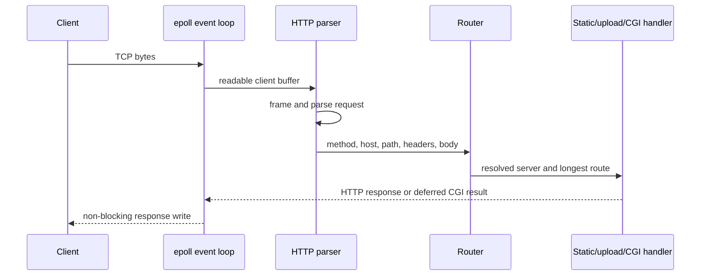

# Localhost — HTTP/1.1 Server in Rust

A configurable HTTP/1.1 web server built in Rust around Linux `epoll`, non-blocking sockets, and a single-process event loop—without an asynchronous runtime such as Tokio.

## Why this project matters

Localhost implements the layers that application frameworks normally hide: socket readiness, connection lifecycles, HTTP parsing and framing, routing, response construction, static files, uploads, CGI processes, limits, timeouts, and error pages.

## Highlights

- Non-blocking TCP listeners and clients multiplexed through Linux `epoll`.
- Parsing for request line, headers, query/path data, and message bodies.
- `Content-Length` and chunked request framing.
- Configurable GET, POST, and DELETE routes with longest-prefix matching.
- Static files, index resolution, redirects, JSON directory listings, and custom error pages.
- Multipart uploads through `multer` and explicit file deletion routes.
- Python CGI execution using `fork`/`execvp` with deferred response collection.
- Configurable body-size limits, request timeouts, idle-client cleanup, and cookie-gated routes.
- Integration checks for listeners, `epoll`, configuration, HTTP parsing, and response behavior.

## Request lifecycle



## Configuration

The server reads `config/server.conf`. Supported directives include:

| Level | Directives |
| --- | --- |
| Server | `host`, `ports`, `server_name`, `client_max_body_size`, `error_page` |
| Route | `methods`, `root`, `index`, `directory_listing`, `redirect`, `cgi`, `cookie_required` |

The parser tokenizes and validates nested `server` and route blocks. Requests are matched by host/port and then by the longest configured route prefix.

## Engineering decisions

- **Readiness-driven I/O:** one event loop manages multiple sockets without one thread per connection.
- **Explicit connection state:** partial requests and writes remain associated with each client until complete.
- **Configuration-first routing:** static, redirect, CGI, upload, and policy behavior can vary by route.
- **Deferred CGI handling:** child-process output returns through the event loop instead of blocking unrelated connections.

## Technology

| Area | Tools |
| --- | --- |
| Language | Rust 2024 edition |
| Operating-system APIs | `libc`, `epoll`, `fork`, `execvp` |
| HTTP/body handling | Custom parser, `bytes`, `multer` |
| Data | Serde and JSON directory listings |
| Testing | Rust integration tests |

## Run

Prerequisites: Linux, the stable Rust toolchain, and Python for the included CGI example.

```bash
cargo run
```

The example configuration listens on <http://127.0.0.1:8080>.

```bash
curl -i http://127.0.0.1:8080/
curl -i -X POST -F "file=@www/uploads/test.txt" http://127.0.0.1:8080/uploads
curl -i http://127.0.0.1:8080/uploads/list
curl -i -X DELETE http://127.0.0.1:8080/uploads/delete/test.txt
```

## Test

```bash
cargo fmt -- --check
cargo clippy --all-targets -- -D warnings
cargo test
```

The suite contains seven unit and integration tests covering request framing, `epoll` operations, and TCP listener binding. The server targets Linux/WSL because its event loop and process management use Unix-specific APIs.

## Current limitations

- HTTP/2, TLS termination, compression, and proxying are outside the current scope.
- CGI support targets Python scripts and Unix process semantics.
- The implementation is educational and has not been load-tested or security-hardened as an internet-facing server.

## My contribution

This was a collaborative team project. **[Vasileios Tsouchataris (Billvats)](https://github.com/Billvats)** contributed across event-loop architecture, HTTP parsing, configuration and routing, file and CGI behavior, error handling, debugging, tests, and integration.

## Team and licensing

Built collaboratively; the canonical repository history records the full team. No project-wide license is declared in this copy, so reuse requires the team's permission.
